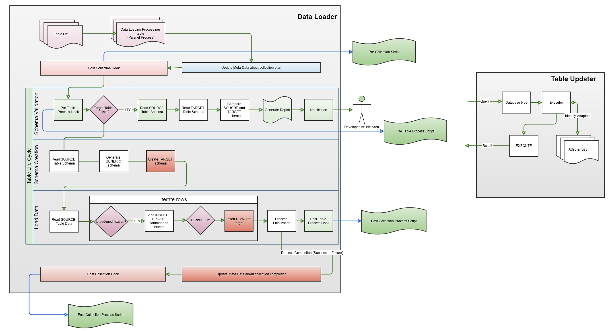

<!-- TOC ignore:true -->
# Facts Freight

<!-- TOC -->
- [Facts Freight](#facts-freight)
- [Idea](#idea)
  - [Features](#features)
- [Design](#design)
- [Process Details](#process-details)
  - [Incremental Collection](#incremental-collection)
- [Supported Databases](#supported-databases)
- [Config Parameters](#config-parameters)
- [Table Config Parameters](#table-config-parameters)

# Idea

A simple ,dumb yet **powerful** data loader tool to transfer data from source to destination with features like

## Features

- **Maintaining schema**: absolute copy of schema from source to destination without losing and data or adding garbage buffer
- **Basic sanitization**: Data conversion as needed
- **Hooks for more flexibility**, you might want to call a custom post process once the collection is over
- **Incremental process**
- **Data validation**: Validate once pushed
- **Schema update validation**: Notify and take necessary action when source schema gets updated.
- **Support all possible data base providers**: Open for custom addition
- **Compatible with cloud and on-prem**
- **Testable**
- **Parallel Processing for performance**
- **Versioning**: Definitely necessary for identifying schema updates
- **Maintains meta information** for each collection for better reporting and debugging

# Design

# Process Details

Each database adapter comes with a very specific set of configuration

1. A set of APIs to interact with data source

2. Data type mapping. Database datatype to generic datatype

Full Collection

1. Read each table from configuration: Start individual process

2. Identify the scope of the columns

3. Identify the **source schema**

4. **Convert the schema to a generic template**

5. Translate the generic schema to target suitable schema

6. Copy data from source table to target table

7. Conclude table collection and update statistics to table

8. Conclude overall collection and update statistics to table along with `version`

Incremental Collection

1. Read each table from configuration: Start individual process

2. Read the version of the tool

3. If current version value is different than last collection
   1. If the the changes are minor
      1. Issue warning and notification
      2. Continue process
   2. If the changes are non-negotiable
      1. Issue high alert
      2. Stop processing

4. Identify rows changed based on `uniquecolumns`

5. Identify the **source schema**

6. **Convert the schema to a generic template**

7. Translate the generic schema to target suitable schema

8. Copy data from source table to target table

## Incremental Collection 

# Supported Databases

Out of the box this tool supports following databases, however the its not limited. One can write adapter for any database and use it.
| Type     | Source/Destination | Version |
| -------- | ------------------ | ------- |
| Aurora   | Source             |         |
| Postgres | Source             |         |
| Vertica  | Destination        |         |

# Config Parameters

A set of configuration parameters.

| Name                        | Type   | Mandatory? | Purpose                                                                                | Default |
| --------------------------- | ------ | ---------- | -------------------------------------------------------------------------------------- | ------- |
| source                      | string | yes        | Type of the source database                                                            |         |
| target                      | string | yes        | Type of the target database                                                            |         |
| bucket_size                 | number | no         | Bucket size for each transaction                                                       |         |
| object_prefix               | string | no         | Type of the target database                                                            | 100     |
| version                     | string | yes        | Unique version number. An updated value invokes schema validation                      |         |
| log.max_file_count          | number | no         | Maximum number of log file                                                             | 5       |
| hooks.pre_table_collection  | string | yes        | A python file path that will be executed `before` processing each table                |         |
| hooks.post_table_collection | string | yes        | A python file path that will be executed `after` processing each table                 |         |
| hooks.post_table_collection | string | yes        | A python file path that will be executed `before` collection starts                    |         |
| hooks.post_table_collection | string | yes        | A python file path that will be executed `after` collection finished                   |         |
| source_server               | string | yes        | Source server connection string consists of `server`,`port`,`user`,`database`,`schema` |         |
| target_server               | string | yes        | Source server connection string consists of `server`,`port`,`user`,`database`,`schema` |         |

# Table Config Parameters

A set of parameters to identify list of tables that needs to be collected.

| Name         | Type        | Purpose                                            | Default |
| ------------ | ----------- | -------------------------------------------------- | ------- |
| name         | string      | The table name                                     |         |
| type         | string      | Type of the object. `t` for table and `v` for view |         |
| columns      | string:list | A list of columns to be collected                  | all     |
| uniqucolumns | string:list | A column set that defines uniqueness of a row      | none    |

